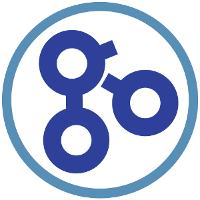

<a href="http://help.geneontology.org" class="navbar-brand"> Helpdesk</a>
-   <a href="http://help.geneontology.org" id="dropdown01" class="nav-link dropdown-toggle">Resources</a>
    <a href="http://geneontology.org" class="dropdown-item">GO Home</a> <a href="http://geneontology.org/faq-page" class="dropdown-item">FAQs</a> <a href="https://github.com/geneontology/helpdesk/discussions" class="dropdown-item">Questions/issues/suggestions</a> <a href="http://status.geneontology.org/" class="dropdown-item">Status</a>

The GO Helpdesk
===============

Welcome to the [Gene Ontology](http://geneontology.org) Helpdesk.

Do you have general questions about GO? Check our [Frequently Asked Questions](http://geneontology.org/faq-page), as your query may have already been answered.

Do you have a specific question about the GO, its data, usage, software, or services? [Create a ticket](https://github.com/geneontology/helpdesk/discussions) on our discussion tracker and join the [GO community](https://github.com/geneontology/) on GitHub!

Are you having trouble using or connecting to any of our public services? Check our [status page](http://status.geneontology.org/).

Are you interested in contributing to annotations or the ontology? Please visit the [guide on Contributing to GO](http://geneontology.org/page/contributing-go).

Join our mailing lists and stay informed! The GOC supports several mailing lists to foster discussion within the GO community. Subscribe to our public GO-friends list to follow general developments, discussions about the GO, or to post a message to the GO community. Contributing members of the GOC should [contact us](mailto:help@geneontology.org) to ensure they have been added to the correct lists.

-   [GO-friends mailing list](https://mailman.stanford.edu/mailman/listinfo/go-friends)

Still have a question or comment? Please [send us an email](mailto:help@geneontology.org) and we will respond as soon as possible.

Best wishes,
-The GO Helpdesk Team

Copyright © 1999-2024 [the Gene Ontology](http://geneontology.org/ "The Gene Ontology project website") ([CC-BY 4.0](http://geneontology.org/page/use-and-license))
The Gene Ontology Consortium is supported by a P41 grant from the National Human Genome Research Institute (NHGRI) \[grant [U41 HG002273](https://projectreporter.nih.gov/project_info_details.cfm?aid=9209989)\].
